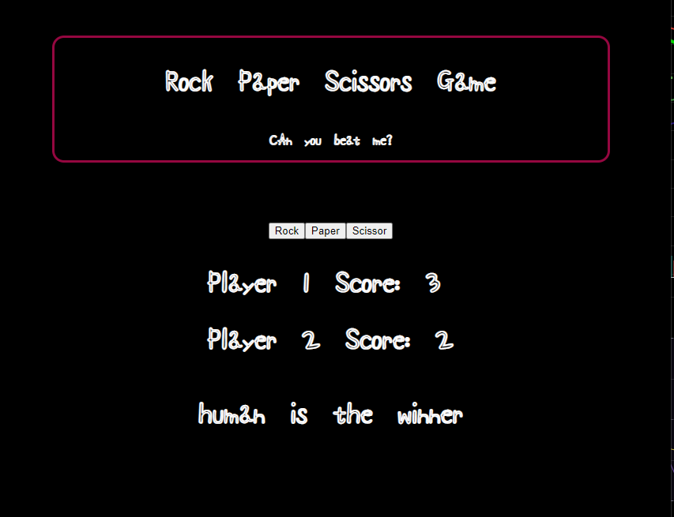
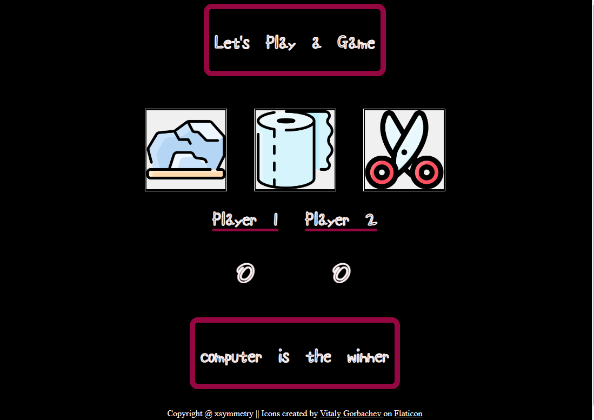

# rock-and-paper-and-scissor 
Live link: https://xsymmetry9.github.io/rock-and-paper-and-scissor/

This is a project from Odin Project

## Main Focus

To practice getting comfortable with Flex boxes and writing functions on JS

## My History

The tip given by ODIN PROJECT is 

### "Tip: use the console to make sure this is returning the expected output before moving to the next step!"

## Logic Thinking

Rock = 1
Paper = 2
Scissors = 3

Winner = [[1,3],[2,1],[3,2]]

When user press the button,
1. Generates a random number
2. Converts value of buttons to an interger
3. Check if it's a winning combination