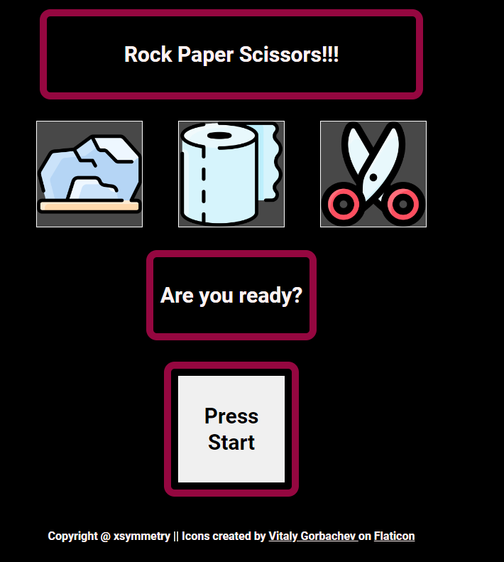

# rock-and-paper-and-scissor 
Live link: https://xsymmetry9.github.io/rock-and-paper-and-scissor/

This is a project from Odin Project

## Main Focus

1. Practice display property (flex, none, block)
2. Practice callback functions
3. Arrow Functions (later)

## My History

The tip given by ODIN PROJECT is 

### "Tip: use the console to make sure this is returning the expected output before moving to the next step!"

